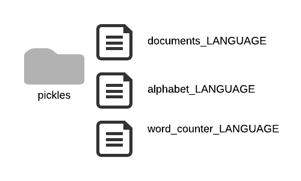

# Language Detection Fellowship.ai challenge

This repository contains the code in response to the [Fellowship.ai challenge](https://fellowship.ai/challenge/) for language detection. It uses the nltk libray and is written in Python.

I experimented with different ways to generate features to use for training. I started by looking at the most common words and letters for each language and trying multiple hyperparameter combinations. I then introduced the top 10, three letter endings for each language and the most used common letters.   At the end the latter gave the best results (see table at bottom of page).

The [Detect Language Final](Detect%20Language%20Final.ipynb) jupyter notebook is a good summary that shows the steps and the result.

Also of note, the [final_hyperparameter_tuning_using_percentage_of_words.py](final_hyperparameter_tuning_using_percentage_of_words.py) contains the hyperparameter tuning code.

## Getting Started

The corpora given on the challenge is the [European Parliament Proceedings Parallel Corpus](http://www.statmt.org/europarl/). This includes 21 different languages.

File Structure:

* txt: contains the unzipped corpora. There are 21 folders each contain the documents for each language (bg, es, et, fi, fr, etc.). **Note:** Do to its size, this repository does not contain the actual files. They must be downloaded manually and install in this folder if they wished to be processed.

* pickles: contains all documents from corpora, all words found and all letters used on each language. These files are serialized(pickle) from their original format and used to train the classifiers. Instead of reading the raw files from txt directory every time, I used this for faster training.

* models: contains deployed models once trained. This is used on the last step to evaluate accuracy of different models against the entire test file.

* util: is a Python package with functions used in this repository. 

#This project was divided into six steps:

**Step 0**

This is pre-processing step. Only ran as data preparation to convert data into a easier and faster to read format.

Process all files on the corpora, and extract the text from each one of the files by removing any HTML tag. Save data as pickles files for easier processing when hypertuning. The [Create Pickles from Corporate](Create%20Pickles%20from%20Corpora.ipynb) reads the /txt directory and creates the processed serialized version in /pickles.  Three files are created for each language:

* word_counter_LANGUAGE: List of all words found in LANGUAGE and frequency.

     Example for Spanish (LANGUAGE=es):

     [('de', 3844857),('la', 2495865),('que', 2051997),('en', 1531406),('y', 1423324),('el', 1375508),....]

* alphabet_LANGUAGE: List most common letters in LANGUAGE and frequency.

     Example for Spanish:
     
     [('e', 37484208),('a', 30954351),('o', 24468965),('s', 21601056),('n', 20135162),....]

* documents_LANGUAGE: List of tuples for each document of the form:

     ([‘word1’,’word2’,'word3',...],'LANGUAGE')

     Example:
     
     (['Preguntas','orales','y','declaraciones','por','escrito','presentación','véase','el','Acta'],'es')

**Step 1**
Read pickle files for processing based on the following parameters:

* number_of_documents      - How many documents from each language to use 
* upto_percentage          - Percentage of top common words to use per language
* number_of_common_letters - Number of letters of that language to use for endings and for most common letters

**Step 2**
Extract most common words up per each language and create featureset for each document. This is used for training. 

Feature set contains the most common words for all languages (using upto_percentage),the the top n word endings and the top n letters for that language.

Example of feature set for a Polish(pl) document when upto_percentage=5, number_of_common_letters=7:
  
({'aasta': False,'abbiamo': False,  
  'affected': False,  
  'ako': False,    
  'amendements': False,  
  'anderen': False,  
  'andra': False,    
  'apie': False,    
  'arī': False,  
  'at': False,  
  'aujourd': False,  
  'bereits': False,  
  'buvo': False,  
  'být': False,  
  'būtų': False,  
  'comissão': False,  
  'commissie': False,  
  'common_ending_top_1': 'trz',  
  'common_ending_top_2': 'kół',  
  'common_ending_top_3': 'nie',  
  'common_ending_top_4': 'ołu',  
  'common_ending_top_5': 'z',  
  'common_ending_top_6': 'ego',  
  'common_ending_top_7': 'nia',  
  'common_letters_2': 'oe',  
  'common_letters_3': 'oep',  
  'common_letters_4': 'oepz',  
  'common_letters_5': 'oepzr',  
  'common_letters_6': 'oepzri',  
  'common_letters_7': 'oepzrit',  
  'completely': False,  
  'concernant': False,  
   ....})  
  
Example of feature set for a Bulgarian(bg) document when upto_percentage =0 (only use letters and endings):
  
({'common_ending_top_1': 'ния',  
  'common_ending_top_10': 'по',  
  'common_ending_top_2': 'ата',  
  'common_ending_top_3': 'и',  
  'common_ending_top_4': 'чаи',  
  'common_ending_top_5': 'на',  
  'common_ending_top_6': 'ята',
  'common_ending_top_7': 'ипа',  
  'common_ending_top_8': 'ава',  
  'common_ending_top_9': 'ане',  
  'common_letters_2': 'аи',  
  'common_letters_3': 'аир',  
  'common_letters_4': 'аирв',  
  'common_letters_5': 'аирвн',  
  'common_letters_6': 'аирвнп',  
  'common_letters_7': 'аирвнпк'},  
  'bg')  
    

**Step 3**
Divide date set into training and test sets.

**Step 4**
Build and score the model. Build with training set, score with test set. For this model I used a NaiveBayesClassifier.

**Step 5**
Deploy model against the europarl.test test file and show score of model. This tries to classify each line on the europarl.test file and calculates whether it did it correctly or not.

## Results

After tuning three hyperparameters (documents to extract, percentage of top words, and number of common letters) the best result against the europarl.test was of **94.75**.  The following table shows the different scores obtained based on the different parameters.

FINAL ACCURACY|Documents to extract|Top percentage of words to use|Number of common Letters to use|Classifier accuracy on test set|Europarl test accuracy|Model accuracy against europarl.test|All documents processed|Number of features used|Training set|Test set|Classifier accuracy on test set|Europarl test accuracy|Model accuracy against europarl.test
--------------|--------------|--------------|--------------|--------------|--------------|--------------|--------------|--------------|--------------|--------------|--------------|--------------|--------------| 
|94.75|5000|0|10|96.59|94.75|105000|0|84000|21000|  
|94.73|5000|0|7|96.87|94.73|105000|0|84000|21000|  
|94.66|5000|0|5|96.54|94.66|105000|0|84000|21000|  
|94.6|5000|0|15|96.9|94.6|105000|0|84000|21000|  
|94.52|10000|5|5|97.03|94.52|187071|129|149656|37415|  
|93.56|10000|10|10|96.44|93.56|187071|415|149656|37415|  
|93.51|5000|5|5|96.34|93.51|110000|121|88000|22000|  
|92.63|5000|5|5|96.8|92.63|105000|129|84000|21000|  
|92.6|5000|10|5|95.99|92.6|110000|399|88000|22000|  
|91.91|5000|10|10|96.41|91.91|105000|415|84000|21000|  
|91.44|10000|15|5|94.93|91.44|187071|856|149656|37415|  
|91.39|3000|5|5|96.06|91.39|66000|119|52800|13200|  
|90.15|3000|10|5|94.93|90.15|66000|389|52800|13200|  
|89.77|5000|15|5|94.25|89.77|110000|827|88000|22000|  
|89.05|5000|15|5|94.48|89.05|105000|856|84000|21000|  
|87.5|10000|20|6|92.35|87.5|187071|1491|149656|37415|  
|85.88|3000|15|5|93.28|85.88|66000|805|52800|13200|  
|85.87|1000|5|5|94.84|85.87|22000|119|17600|4400|  
|84.65|3000|20|5|90.65|84.65|66000|1423|52800|13200|  
|84.41|1000|10|5|93.38|84.41|22000|389|17600|4400|  
|83.98|5000|20|6|91.18|83.98|105000|1491|84000|21000|  
|80.49|1000|0|7|96.19|80.49|21000|0|16800|4200|  
|80.22|1000|0|15|96.35|80.22|21000|0|16800|4200|  
|80.2|1000|0|5|96.42|80.2|21000|0|16800|4200|  
|80.11|1000|0|10|95.78|80.11|21000|0|16800|4200|  
|78.33|1000|15|5|90.7|78.33|22000|805|17600|4400|  

### Prerequisites

Download the European Parliament Proceedings Parallel Corpus and unzip into the /txt folder.
Generate pickle files by rooning the Create Pickles from Corpora.

## Deployment

Once the models have been generated, you can run the [Deploy - Loop through classifiers for testing of Europarl.test file] (Deploy%20Loop%20through%20classifiers%20for%20testing%20of%20Europarl.test%20file.ipynb) notebook to test against the europarl.test file.
This is only if you are to generate models by tweaking the different hyperparameters.

## License

This project is licensed under the MIT License - see the [LICENSE.md](LICENSE.md) file for details

 